# How to deploy 

### Solution architect: Shawn C[ a.k.a "citypw"]
### Security deployment: Samson 

## Topology 
```
--------------------       --------------------------
|Access Bastion User|----> |Public Network interface \-------------
--------------------       --------------------------|Bastion host |
                                                     /--------------            
                                      ----------------------------
                                      | Private Network interface | 
                                      -----------------------------
                                                  |
                                                  |
                                                  V
        /-------------\--------------------/-------------------------\
   ----------------   ----------------   ----------------    ------------------
   |PrivateServer1 |  |PrivateServer2 |  |PrivateServer3 |   |PrivateServer..N |
   ----------------   ----------------   ----------------    ------------------
```
## Infrastructure selection 
OS: Debian 10.2  
Bastion host project: Bastillion 3.09.00

### Bastion Host info  
Public ip: (ens3)192.168.200.89  
Private ip: (ens10)192.168.122.84  

### Private server Host info 
Private ip: (ens3)192.168.122.56


### Install Bastillion  

#### Prerequisites 
```
# apt-get update
# apt install -y openjdk-11-jdk

export JAVA_HOME=/usr/lib/jvm/java-11-openjdk-amd64
export PATH=$JAVA_HOME/bin:$PATH
```

#### Install Bastillion 
```
# cd /opt
/opt# wget https://github.com/bastillion-io/Bastillion/releases/download/v3.09.00/bastillion-jetty-v3.09_00.tar.gz 
/opt# tar zxvf bastillion-jetty-v3.09_00.tar.gz 
/opt# cd Bastillion-jetty/ 
/opt# cat << EOF >> /etc/sysctl.conf 
net.ipv6.conf.all.disable_ipv6 = 1
net.ipv6.conf.default.disable_ipv6 = 1
EOF
/opt# sysctl -p
/opt# cd Bastillion-jetty
/opt/Bastillion-jetty# bash ./startBastillion.sh 
```
Test:
```
$ wget --no-check-certificate https://192.168.200.89:8443
--2019-12-06 15:05:28--  https://192.168.200.89:8443/
Connecting to 192.168.200.89:8443... connected.
WARNING: The certificate of ‘192.168.200.89’ is not trusted.
WARNING: The certificate of ‘192.168.200.89’ doesn't have a known issuer.
The certificate's owner does not match hostname ‘192.168.200.89’
HTTP request sent, awaiting response... 200 OK
Length: unspecified [text/html]
Saving to: ‘index.html’

index.html                                 [ <=>                                                                         ]   3.62K  --.-KB/s    in 0s      

2019-12-06 15:05:28 (27.3 MB/s) - ‘index.html’ saved [3706]
```

#### Create systemd service for Bastillion
```
~ $ cat << EOF >bastillion.service
[Unit]
Description=Bastion Host Server

[Service]
Type=simple
ExecStart=/usr/bin/bash /opt/Bastillion-jetty/startBastillion.sh

[Install]
WantedBy=multi-user.target
EOF
~ $ sudo mv  bastillion.service /etc/systemd/system/
```

Modify /opt/Bastillion-jetty/startBastillion.sh:
```
sed -i 's/jetty/\/opt\/Bastillion-jetty\/jetty/' /opt/Bastillion-jetty/startBastillion.sh
```

#### Enable and start bastillion.service 
```
~ $ sudo systemctl enable bastillion.service
~ $ sudo systemctl daemon-reload
~ $ sudo systemctl start bastillion.service 
```

### Start Bastillion 
 

If the first login, please set up two authentication: 
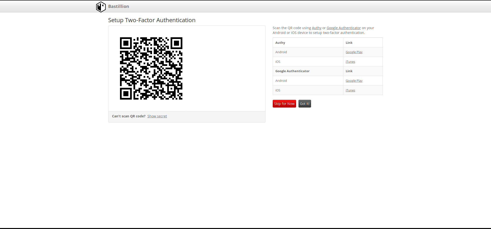 
 
If the first login, please change default password: 
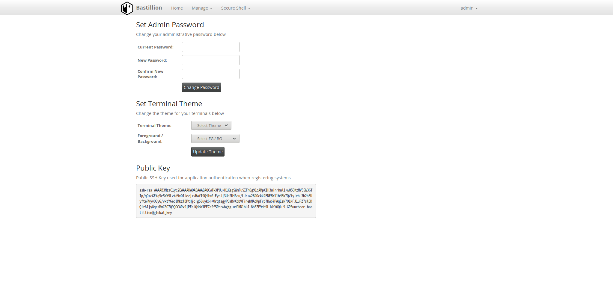 
 
Add private sever to bastion host: 
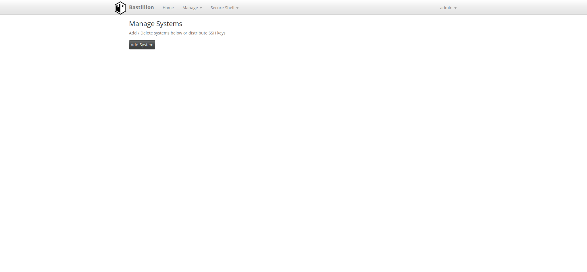 
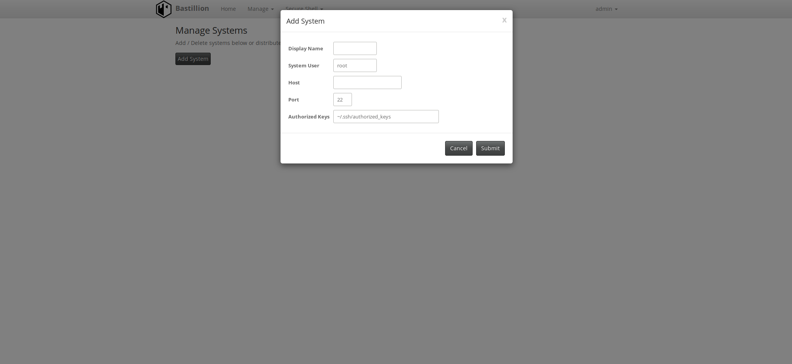 
 
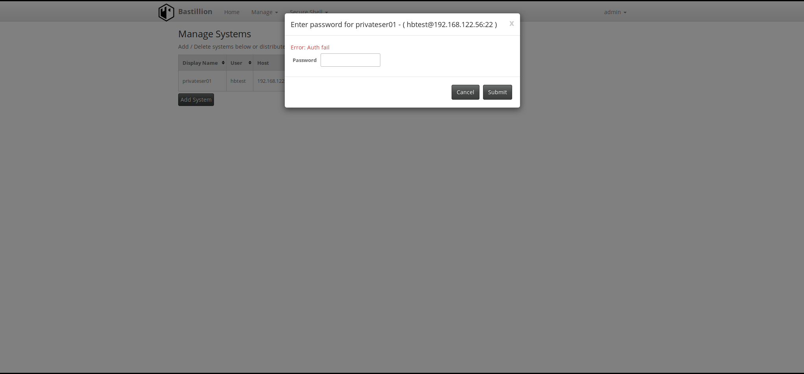 
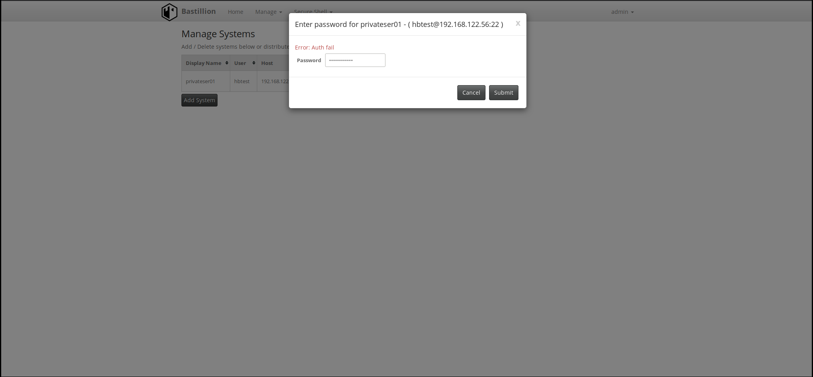 
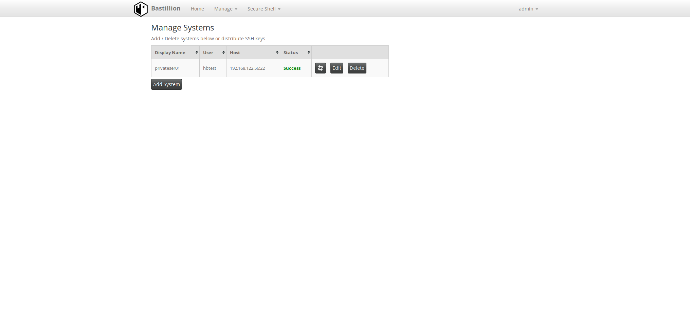 
SSH to private server: 
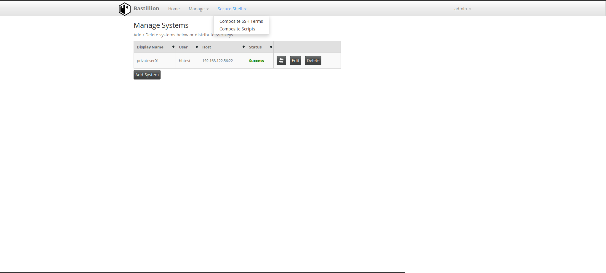 
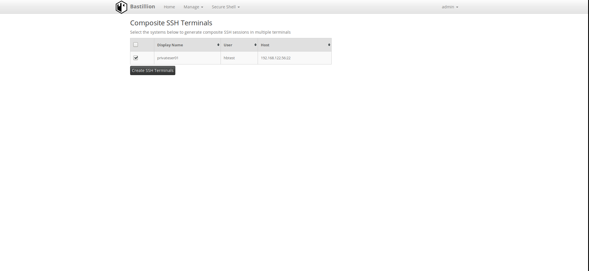 
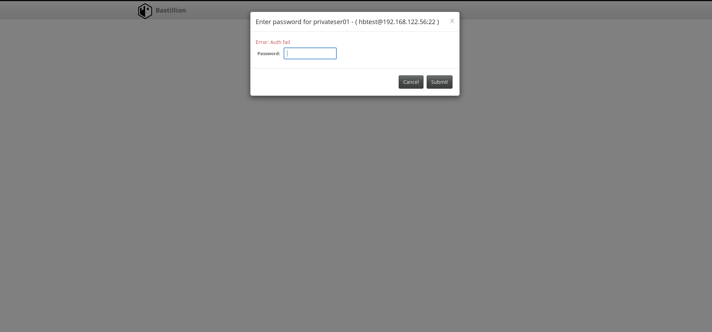 
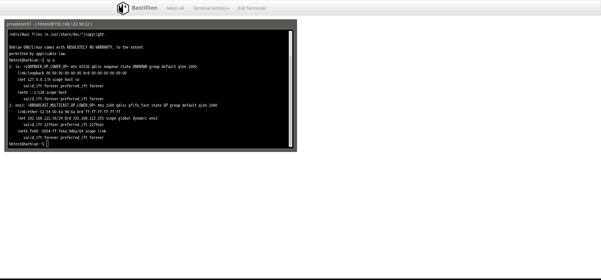 

## Common configuration for Bastion host& Private server  

### Install Grsec/PAX
```
$ git clone https://github.com/citypw/hardened-pwngame.git  
$ cd hardened-pwngame/  
$ sudo bash ./debian_auto_deploy.sh  
$ sudo apt install gradm2 -y  
~# gradm2 -P  
~# gradm2 -P admin  
~# gradm2 -P shutdown  
~# gradm2 -E 
```
If using learning mode, use the following command: 
```
~# gradm2 -F -L /etc/grsec2/learning.logs
~# gradm2  -D
~# gradm2 -F -L /etc/grsec2/learning.logs -O /etc/grsec2/policy
```

### harbian-audit apply 
```
$ sudo apt-get install -y bc net-tools pciutils network-manager unzip
/opt$ sudo wget https://github.com/hardenedlinux/harbian-audit/archive/master.zip 
/opt$ sudo unzip master.zip 
/opt$ cd harbian-audit-master 
/opt/harbian-audit-master$ sudo cp debian/default /etc/default/cis-hardening
/opt/harbian-audit-master$ sudo sed -i "s#CIS_ROOT_DIR=.*#CIS_ROOT_DIR='$(pwd)'#" /etc/default/cis-hardening
/opt/harbian-audit-master$ sudo bin/hardening.sh --init
/opt/harbian-audit-master$ sudo bin/hardening.sh --audit-all
/opt/harbian-audit-master$ sudo ./bin/hardening.sh --set-hardening-level 5

/opt/harbian-audit-master$ sudo sed -i 's/^status=.*/status=disabled/' etc/conf.d/8.1.32_freeze_auditd_conf.cfg 
/opt/harbian-audit-master$ sudo sed -i 's/^status=.*/status=disabled/' etc/conf.d/7.4.4_hosts_deny.cfg 
/opt/harbian-audit-master$ sudo sed -i 's/^status=.*/status=disabled/' etc/conf.d/8.4.1_install_aide.cfg 
/opt/harbian-audit-master$ sudo sed -i 's/^status=.*/status=disabled/' etc/conf.d/8.4.2_aide_cron.cfg 
/opt/harbian-audit-master$ sudo ./bin/hardening.sh --apply 
/opt/harbian-audit-master$ sudo reboot 
```

Second audit && apply(After reboot)
Configuring the firewall:

```
/opt/harbian-audit-master$ sudo -s 
/opt/harbian-audit-master# update-alternatives --set iptables /usr/sbin/iptables-legacy
/opt/harbian-audit-master# update-alternatives --set ip6tables /usr/sbin/ip6tables-legacy 
/opt/harbian-audit-master# update-alternatives --set arptables /usr/sbin/arptables
/opt/harbian-audit-master# update-alternatives --set ebtables /usr/sbin/ebtables
/opt/harbian-audit-master$ INTERFACENAME="ens33 ens36"
/opt/harbian-audit-master$ sudo bash /opt/harbian-audit-master/docs/configurations/etc.iptables.rules.v4.sh $INTERFACENAME 
/opt/harbian-audit-master$ sudo bash /opt/harbian-audit-master/docs/configurations/etc.iptables.rules.v6.sh $INTERFACENAME 
/opt/harbian-audit-master# iptables-save > /etc/iptables/rules.v4 
/opt/harbian-audit-master# ip6tables-save > /etc/iptables/rules.v6
/opt/harbian-audit-master# exit
```
Add Bastillion server rule(Only set in bastion host):
```
~ $ sudo iptables -I INPUT -i ens3 -p tcp -m tcp --dport 8443 -m state --state NEW -j LOG --log-level info  --log-prefix "CONNECT-BASTION-HOST"
~ $ sudo iptables -I INPUT -i ens36 -p tcp -m tcp --dport 8443 -m state --state NEW -j ACCEPT
```

Apply need to apply twice items and that items of must apply after first apply:
```
/opt/harbian-audit-master$ sudo ./bin/hardening.sh --apply --only 8.1.1.2
/opt/harbian-audit-master$ sudo ./bin/hardening.sh --apply --only 8.1.1.3
/opt/harbian-audit-master$ sudo ./bin/hardening.sh --apply --only 8.1.12
/opt/harbian-audit-master$ sudo sed -i 's/^status=.*/status=enabled/' etc/conf.d/8.1.32_freeze_auditd_conf.cfg 
/opt/harbian-audit-master$ sudo ./bin/hardening.sh --apply --only 8.1.32 
/opt/harbian-audit-master$ sudo ./bin/hardening.sh --apply --only 4.5
/opt/harbian-audit-master$ sudo reboot 
```

Third apply(after reboot)

Apply need to apply three times items:
```
/opt/harbian-audit-master$ sudo sed -i 's/^status=.*/status=enabled/' etc/conf.d/8.4.1_install_aide.cfg 
/opt/harbian-audit-master$ sudo sed -i 's/^status=.*/status=enabled/' etc/conf.d/8.4.2_aide_cron.cfg
/opt/harbian-audit-master$ sudo ./bin/hardening.sh --apply --only 8.4.1
/opt/harbian-audit-master$ sudo ./bin/hardening.sh --apply --only 8.4.2
/opt/harbian-audit-master$ sudo reboot 
```

### RBAC of Grsec 

#### For root role
 |   Subject   | Policy  |  Description  |
 |:--------- |:------ | :----------- |
 |  None      | role_allow_ip	192.168.200.1/24 | Allow 192.168.200.1/24 |
 |  /         | /opt/Bastillion-jetty/startBastillion.sh	r | root role can read startBastillion.sh |
 | /usr/bin/bash | /opt/Bastillion-jetty/startBastillion.sh	r | root role can read startBastillion.sh |
 | /usr/lib/jvm/java-11-openjdk-amd64/bin/java | bind 0.0.0.0/32:8443 stream tcp | Can bind local port 8443/TCP(Bastion host web server)  |
 | /usr/lib/jvm/java-11-openjdk-amd64/bin/java |	connect192.168.122.56/32:22 stream tcp | Can connect to private server 192.168.122.101:22 |

#### For hbadmin role 

 |   Subject   | Policy  |  Description  |
 |:--------- |:------ | :----------- |
 |  /        | /etc/ld.so.preload h | prevent LD_PRELOAD trick |
 | /usr/bin/ssh | connect 192.168.122.56/32:22 stream tcp | Can connect 192.168.122.56:22 | 

More details about RBAC POLICY:
```
configuration/RBACofGrsecPolicy/bastionhost-policy
```
Enable RBAC policy:
```
hardened-pwngame$ sudo cp configuration/RBACofGrsecPolicy/bastionhost-policy  /etc/grsec2/policy
~$ sudo gradm2 -E 
```

## Private server host deploy  

### ssh related config
If use public key to authentication, set 'PasswordAuthentication no' on /etc/ssh/sshd_config file.

### RBAC of Grsec 
For hbtest role: 

 |   Subject   | Policy  |  Description  |
 |:----------- |:------- | :------------ |
 | none      | role_allow_ip	192.168.122.84/32  | Only allow 192.168.122.84 |
 | /usr/sbin/sshd    |  bind 0.0.0.0/32:22 stream tcp | Allow bind local port 22 |

More details about RBAC POLICY:
```
configuration/RBACofGrsecPolicy/private-ser01-56-RBAC-policy
```

Enable RBAC policy:
```
hardened-pwngame$ sudo cp configuration/RBACofGrsecPolicy/private-ser01-56-RBAC-policy  /etc/grsec2/policy
~$ sudo gradm2 -E 
```

The RBAC of the PRIVATE-56 server is just a simple example, and it should be modified according to specific operations in the production environment.

## Reference  
[https://github.com/bastillion-io/Bastillion](https://github.com/bastillion-io/Bastillion)  
[https://www.grsecurity.net/](https://www.grsecurity.net/)  


